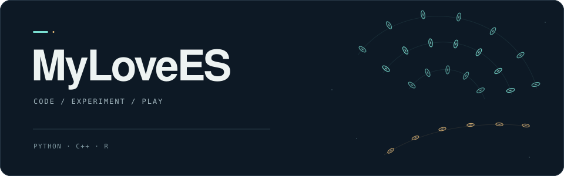

  

  <a href="https://mylovees.github.io/"><b>博客 · Disco</b></a>
  &nbsp;&nbsp;/&nbsp;&nbsp;
  <a href="https://github.com/MyLoveES?tab=repositories"><b>全部项目</b></a>

### 一些工具，一些实验，也有一些弹幕。

Hi，我是 **MyLoveES**。这里放着我的 AI 相册、东方弹幕游戏、Python 工具与学习记录。也在[博客](https://mylovees.github.io/)里，记录 AI 服务部署与编程实践。

## 作品与实验

<table>
  <tr>
    <td width="50%" valign="top">
      01 / VISION
      <h3><a href="https://github.com/MyLoveES/iphoto_project">iphoto_project</a></h3>
      
AI 智能相册，关于影像与 AI 的一次探索。

      
<code>Python</code> <code>AI 相册</code>

    </td>
    <td width="50%" valign="top">
      02 / PLAY
      <h3><a href="https://github.com/MyLoveES/AliceGame">AliceGame</a></h3>
      
自制东方弹幕游戏，把想法写成屏幕上的弹幕。

      
<code>C++</code> <code>弹幕游戏</code>

    </td>
  </tr>
  <tr>
    <td width="50%" valign="top">
      03 / TOOLS
      <h3><a href="https://github.com/MyLoveES/12306-scrapy">12306-scrapy</a></h3>
      
当年想买张票，于是留下了这个 Python 项目。

      
<code>Python</code> <code>12306</code>

    </td>
    <td width="50%" valign="top">
      04 / LEARNING
      <h3><a href="https://github.com/MyLoveES/R_Lesson">R_Lesson</a></h3>
      
R 语言课程资料与作业，把学习过程留在代码里。

      
<code>R</code> <code>学习记录</code>

    </td>
  </tr>
</table>

还有一份与弹幕编程有关的记录：[《龙神录》编程教程](https://github.com/MyLoveES/LongShen)。

## 写在博客里

- [AI Services On Ascend](https://mylovees.github.io/p/ai-services-on-ascend/)
- [Vibe Coding IV — Harness Engineering](https://mylovees.github.io/p/vibe-coding-iv-harness-engineering/)
- [OpenClaw I — Deployment](https://mylovees.github.io/p/openclaw-i-deployment/)

<a href="https://mylovees.github.io/">更多文章 →</a>

---

Wind rises.

